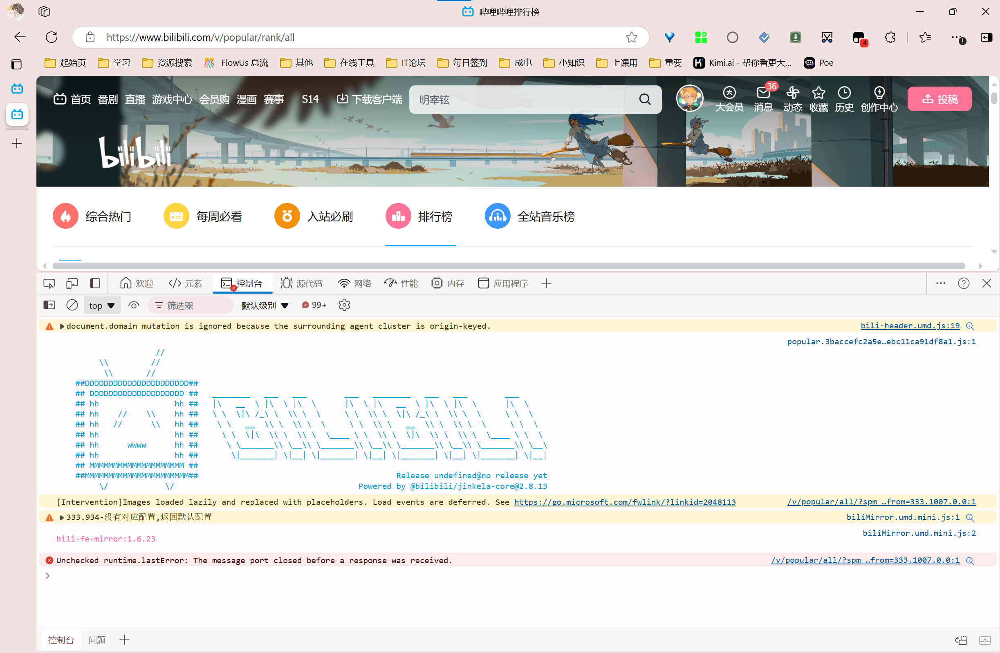
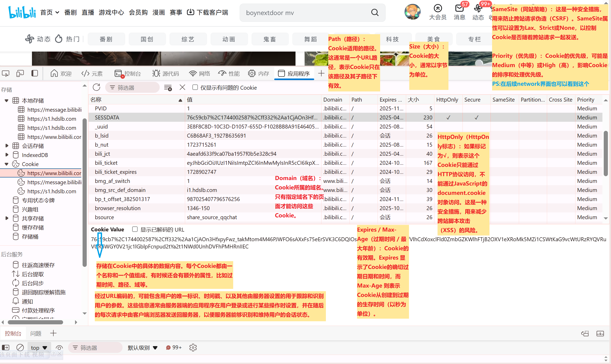
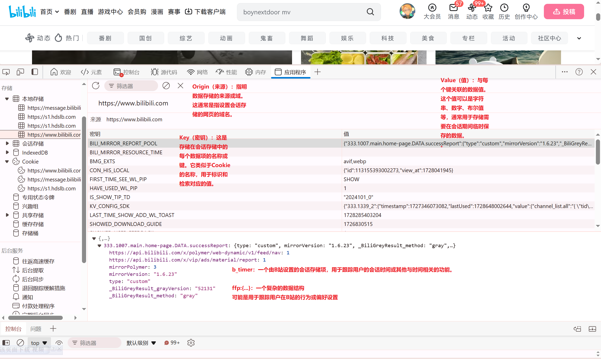
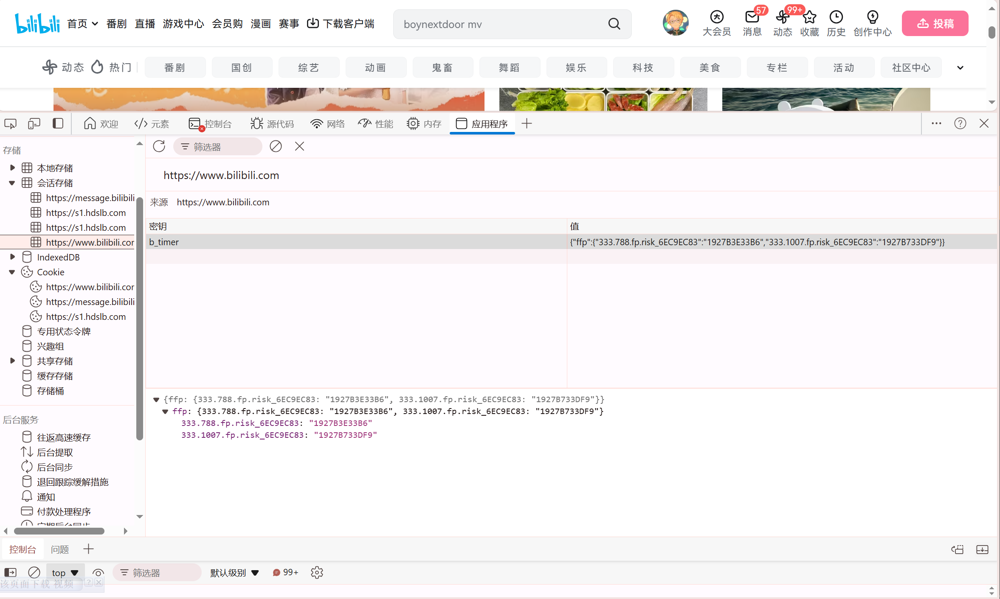
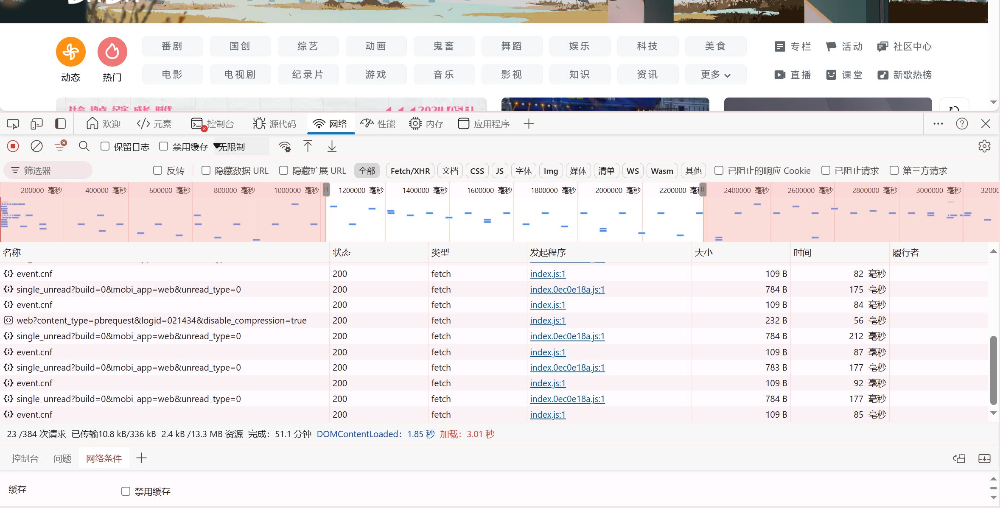
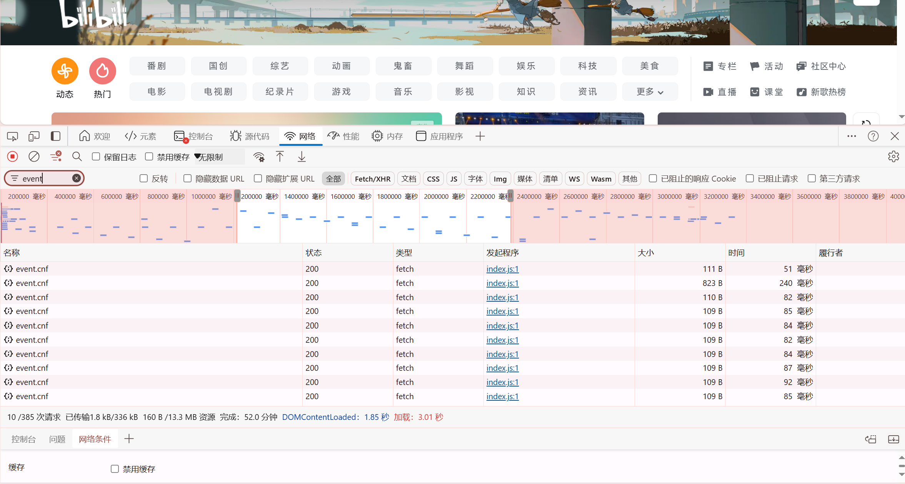

### 1.查看排行榜页面 console 内容

哇塞！是小电视！

或许是**用JavaScript的console.log()语句**输出的？

### 2.查看B站cookie,本地存储空间,会话存储空间

#### cookie

#### local storage
>会话存储
一种Web存储API，它允许网站在用户的浏览器中存储键值对数据，仅在页面会话期间有效，也就是说，当用户关闭浏览器标签或窗口时，存储的数据会被清除。

>会话存储中的数据只在当前会话中有效，不像Cookie那样可以设置过期时间。会话存储的数据在用户关闭浏览器标签页或窗口后就会被清除。此外，会话存储是按照同源策略隔离的，不同域的页面无法访问彼此的会话存储数据。

#### session storage

#### 区别
>持久性：
localStorage：**数据是持久的**，即使关闭浏览器窗口或标签页，数据也会保留。数据会保留直到主动删除或者浏览器清除数据。
sessionStorage：数据**只在浏览器标签页或窗口的会话期间有效**。一旦关闭标签页或窗口，数据就会被清除。
作用域：
localStorage：数据是按照域（协议+域名+端口）隔离的。同一个域下的所有标签页和窗口都可以访问和修改相同的数据。
sessionStorage：数据也是按照域隔离的，但**每个标签页或窗口都有独立的存储空间**。即使它们都是同一个域下的页面，不同的标签页或窗口之间的 sessionStorage **数据也是隔离**的。
可用性：
localStorage：因为数据是持久的，所以可以在用户的**多次访问**之间保持数据，适合存储主题选择、用户偏好设置等不需要频繁变动的数据。
sessionStorage：因为数据只在会话期间有效，**适合存储临时数据**，如表单填写时的中间状态、游戏会话数据等。
同步性：
localStorage 的数据更改是同步的，这意味着在**多个标签页或窗口中**更改 localStorage 的数据会立即反映在所有其他标签页或窗口中。
sessionStorage 的数据更改也是同步的，但**仅限于同一个标签页或窗口**内。

→从上面看出session storage相比local storage来说数据的存储时长更短，更安全，但是不适宜某些需要长期或多窗口使用的数据的储存

### 3.记录B站网络活动(network)(你能从中收集什么信息呢)
<video width="640" height="480" controls>
    <source src="./media/network.mp4" type="video/mp4">
</video>

>1. **Name（名称）**：显示了请求的资源名称，通常包括文件的类型或**请求的URL**。
   注意包含url！
>2. **Status（状态）**：**HTTP响应状态码。**例如，`200` 表示请求成功，`304` 表示资源未修改，可以使用缓存的版本，`404` 表示未找到资源。
>3. **Type（类型）**：请求的**资源类型**，如 `script`（脚本），`img`（图片），`css`（样式表）等。
>4. **Initiator（发起程序）**：显示了请求是由哪个文件发起的。这**有助于开发者了解是哪个脚本或页面元素触发了网络请求**。
>5. **Size（大小）**：请求和响应的**数据大小**，通常包括响应头和响应体的大小。
>6. **Time（时间）**：完成请求所需的总时间，包括从**发送请求**到**接收到最后一个字节**的响应的时间。
   
>7. **Waterfall（时间线）**：一个可视的时间线，展示了请求的发起、响应和加载的顺序。它可以帮助开发者了解资源加载的顺序和时间点。
试了一下可以截取选择特定的时间段进行分析

#### 一些补充：

**10/388次请求**：加载的资源数量 / 总资源数量
**已传输 1.8kb/337kb 160b/13.3mb资源**：已传输的数据大小 / 总数据大小 / 页面内容的大小
**完成/ DOM Content Loaded / 加载**：第一个字节时间（服务器响应时间）/ DOM内容加载完成时间 / 页面完全加载时间
   
**左上角筛选栏**：允许用户过滤显示特定类型的网络请求
**保留日志**：即使在页面刷新或跳转后，也保留网络请求的日志

ps：
**右键Save all as HAR with content 可以将网络日志保存下来**