# JS
### 1.function collectPuzzle(...puzzles) 中的...什么意思？
- ... :“扩展运算符”（spread operator）
- 实例分析：
```collectPuzzle(...puzzles)```
puzzles是一个另外的数组 作用：包含所有传递给函数的参数，使得传参的参数数量不受限制，不是固定的
**(1)如果不使用扩展运算符(...)?**
> 调用函数时传递的参数数量多于函数定义时指定的参数数量，那么多出来的参数将被忽略。同样，如果调用函数时传递的参数数量少于函数定义时指定的参数数量，那么未传递的参数将会是undefined。
```javascript
function collectPuzzle(redPuzzles,bluePuzzles,greenPuzzles) {
  console.log(redPuzzles,bluePuzzles,greenPuzzles);
}

collectPuzzle('redPuzzles', 'bluePuzzles', 'greenPuzzles'); // 输出: puzzle1 puzzle2 puzzle3
collectPuzzle('redPuzzles', 'bluePuzzles'); // 输出: puzzle1 puzzle2 undefined
collectPuzzle('redPuzzles', 'bluePuzzles', 'greenPuzzles', 'pinkPuzzles'); // 输出: puzzle1 puzzle2 puzzle3
```
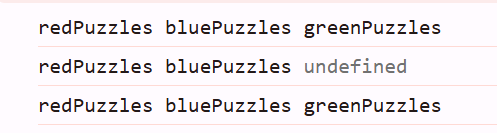
**(2)用(...puzzle)而不是直接(...)？**
...puzzle：表示你正在将参数收集到一个名为puzzle的数组中。
>这个数组可以用来引用、操作或遍历所有传递给函数的参数。

直接使用...而不指定一个变量名，不符合语法。必须包括一个变量名，创建一个数组来存储参数。

### 2.var/let/const的区别？
[var/let/const辨析](https://blog.csdn.net/xiewenhui111/article/details/113133330)
**1. 变量提升**
var：存在变量提升，变量可以在声明之前调用，输出undefined
let和const：不存在变量提升，一定要在声明后使用，否则报错
**变量提升：** 
> 在函数或全局作用域中声明的变量，不论它们在代码中的位置如何，都会在函数或全局作用域的开始处“提升”到顶部。这意味着在代码执行前，变量已经被声明，即使它们的赋值可能发生在声明之后。

**注：** 会发生这种情况是因为js在执行代码之前，会先扫描整个作用域，将所有的变量和函数声明“提升”到作用域的顶部。而不是按顺序顺着作用域边扫描边执行
虽然let和const变量也会被提升，但是会形成Temporal Dead Zone(TDZ)，无法访问，不太容易造成混淆
**2. 块级作用域**
var不存在块级作用域
let和const存在块级作用域
**注：** 块级作用域：{}包裹的部分
**3. 重复声明**
var允许重复声明变量 (后面的声明会覆盖前面的)
let和const在同一作用域不允许重复声明变量
**4. 修改声明的变量**
var和let可以
const声明一个只读的常量。一旦声明，常量的值就不能改变，**但对于对象和数据这种引用类型，内存地址不能修改，可以修改里面的值。**
(怪不得const声明的我的微光招新用户名还可以改，里面的值是可以修改的，只是常量不能变而已)

**const包含let的特点**

### 3.== 与 === 的区别？
1. ==（等于）
   会进行类型转换（如果类型不同），然后再进行比较
```javascript
'5' == 5 // true， 字符串 - 数字
0 == false // true， 数字 - 布尔值
'' == 0 // true， 空字符串 - 数字
```
2. ===（严格等于）
   不会进行类型转化，上面三个都是false
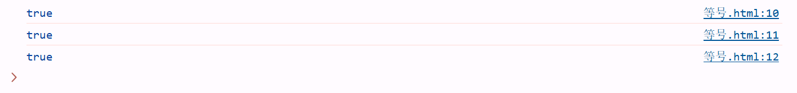

!=（不等于）   !==（严格不等于）

### 4.如何把元素中的数据保存进入变量?排序比大小？
##### 保存进变量
```javascript
<!DOCTYPE html>
<html lang="en">
<head>
    <meta charset="UTF-8">
    <title>get</title>
</head>
<body>
    <!-- ID 选择器 -->
    <p id="static1">一</p>
    <!-- 类选择器 -->
    <p class="static2">二</p>
    <p class="static2">三</p>
    <p class="num">11</p>


    <script>
        //getElementById--ID选择器
        let get1 = document.getElementById('static1');
        //console.log(get1);
        console.log(get1.textContent);
        // querySelector--只会返回第一个元素，没有就是null
        let get2 = document.querySelector('.static2');
        //括号里的类选择器需要以.开头
        //console.log(get2);
        console.log(get2.textContent);

        // let data = (.num); 
        // console.log(data)

        let number = document.querySelector('.num');//获取文本
        //let data = parseInt(number.textContent); // 转换数字
        let data = parseInt(number.textContent,10); // 确保转化为十进制
        console.log(data); 
    </script>
</body>
</html>
```
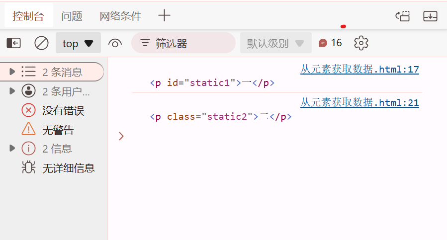
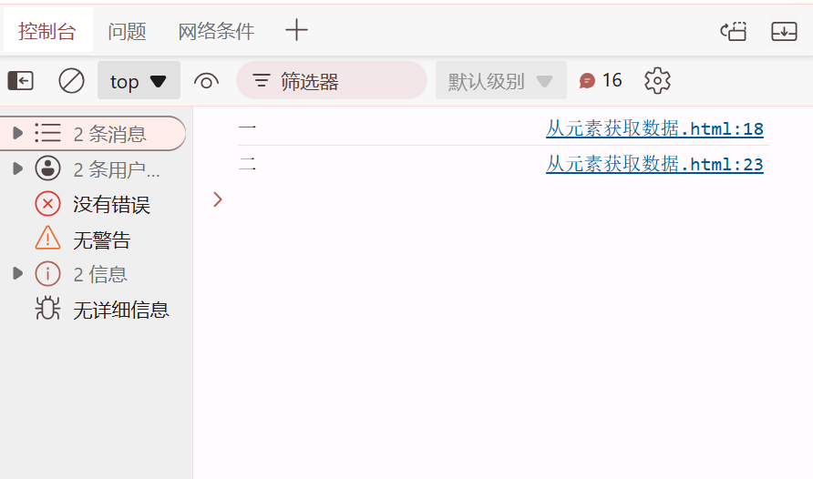
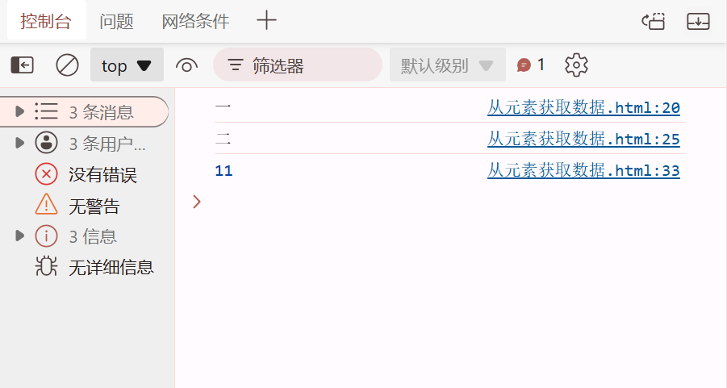

##### 排序比大小
获取元素中的数据存到变量，转化为数字类型，变量中的数字存到数组里，数组里升/降排序，再依次获取数组里的数存回变量，输出

# F12
## 1.直接用f12模拟调整页面视窗大小？直接修改元素？

写响应式布局好用
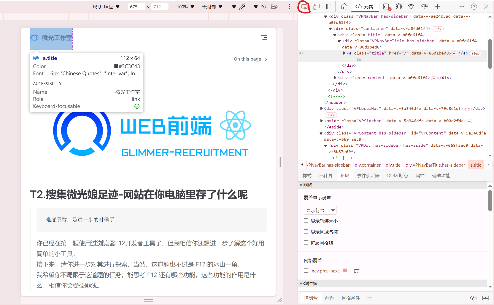
高亮选中想改的元素后在element里改就行
## 2.cookie和存储(local/session storage)
### cookie的定义？
cookie,一些数据信息，“小型文本文件”
cookie为网页服务器创建后保存的文件，浏览器只进行保存
cookie是以键值对进行表示的(key-value)，key为名字，value为cookie的值
### cookie的存储
cookie存储方式:1.会话性(仅会保存在客户端的内存中，关闭客服端时cookie失效)，2.持久性(保存在用户的硬盘中，直至生存期结束或者用户主动将其销毁)
(Expires即为cookie的过期时间)
### status栏
- 200是什么意思？
- Status（状态）：**HTTP响应状态码。** 例如，200 表示请求成功，304 表示资源未修改，可以使用缓存的版本，404 表示未找到资源。
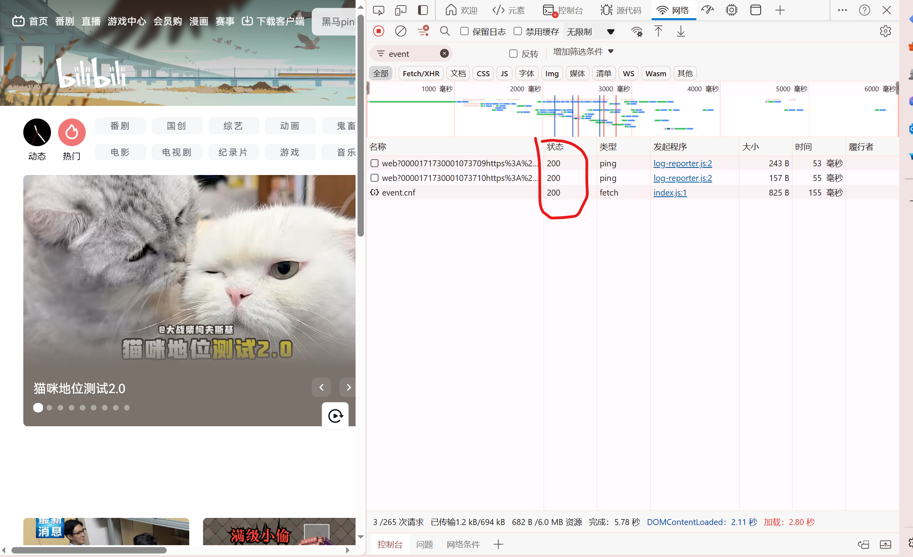
### local/session storage,cookie的查看
- [cookie详解](https://blog.csdn.net/m0_51545690/article/details/123359959)
是在"应用程序application"里面看local/session storage,cookie！
- local/session storage只能存储字符串，但可以存储JSON对象，并通过JSON.parse()和JSON.stringify()来序列化和反序列化。

注：
(1)json:轻量级的数据交换格式
(2)序列化:将对象的状态信息转换为可以存储或传输的格式（如JSON、XML等）的过程。序列化后的数据通常可以被写入文件、数据库或通过网络发送到其他计算机。
(3)JavaScript提供了JSON.stringify()和JSON.parse()两个方法来分别实现序列化和反序列化：
JSON.stringify()：将JavaScript对象或值转换为JSON字符串。
JSON.parse()：将JSON字符串转换为JavaScript对象。

尝试：
1. 试了一下看存储的搜索记录字符串
把localstorage的数据直接在div里了
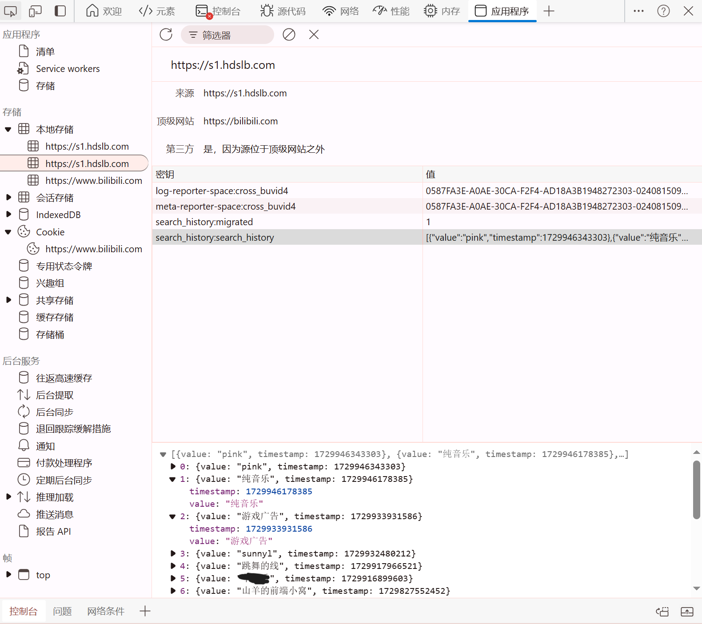
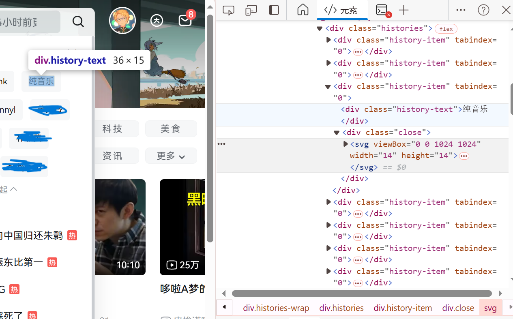
1. 然后密码不会明文放在application里面，应该加密了

## 3.Network
### GET/POST是什么？
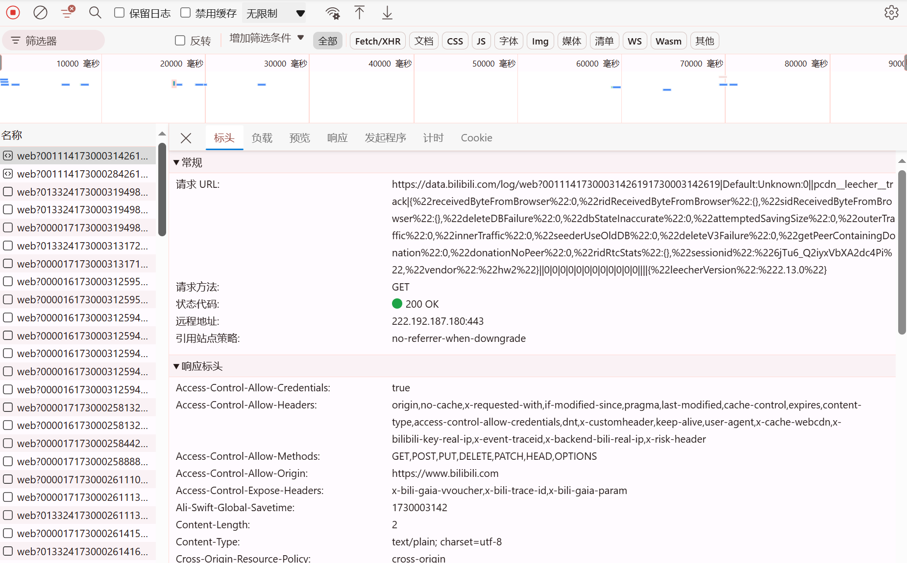
**(1)GET/POST-http请求方法:指定客户端希望对服务器上的资源执行的操作
(2)端口地址：ip地址+端口 图上这个是https的端口号**
附：
> 常见的HTTP请求方法包括：
    1. **GET**：
    - 用于请求**访问服务器上的资源**。它是最常用的方法，通常用于请求网页或数据。
    - **数据被附加在URL上，以查询字符串参数的形式传递。**
    2. **POST**：
    - 用于向服务器**发送**要处理的**数据**，例如**表单**提交。
    - 数据被**包含在请求体**中，不显示在URL中。
    3. **PUT**：
    - 用于**上传文件**或**更新**服务器上的**资源**。它通常用于替换目标资源的内容。
      (**辨析：**
      POST相当于是更新，把原来的覆盖或者新建
      PUT可能会创建多个资源) 


​    
    **了解：**
    4. **DELETE**：
    - 用于删除服务器上的资源。
    5. **HEAD**：
    - 类似于GET请求，但它只请求页面的头部信息，不返回响应体。
    - 用于检查资源是否存在，或者获取资源的元数据。
    6. **OPTIONS**：
    - 用于描述目标资源的通信选项，例如服务器支持哪些HTTP方法。
    7. **PATCH**：
    - 用于对服务器上的资源进行**部分修改**。它与PUT不同，PUT通常用于更新整个资源。
    8. **CONNECT**：
    - 用于将连接改为管道方式的代理服务器。通常用于SSL加密服务器的连接。
    9. **TRACE**：
    - 用于追踪请求-响应链。服务器会将请求返回给客户端，通常用于测试或诊断。
# Web
### 1.http协议？https协议？
协议是互联网通信的基础！
**http是明文传输，没有加密
https通过SSL/TLS协议进行数据加密、完整性校验、身份验证，更加安全**
>1. **HTTP（超文本传输协议）**：
      - HTTP是一种应用层协议，用于**在客户端（如浏览器）和服务器之间传输超文本数据**，例如网页。
      - 它定义了客户端和服务器之间请求和响应的格式。
      - HTTP是无状态的，意味着**每个请求都是独立的**，服务器不会保存之前请求的任何信息。
      - HTTP使用**明文传输数据**，这意味着数据在传输过程中可能被截获或篡改，因为它没有加密。
>2. **HTTPS（超文本传输协议安全版）**：
      - HTTPS是HTTP的**安全版本**，它在HTTP的基础上通过SSL/TLS协议提供了**数据加密、完整性校验和身份验证**。
      - 数据加密确保了数据在传输过程中的安全性，防止数据被截获或篡改。
      - 完整性校验确保数据在传输过程中没有被篡改。
      - 身份验证允许服务器和客户端验证对方的身份，确保数据发送给了正确的接收者。
      - **HTTPS使用端口443，而HTTP使用端口80。**
      - 浏览器和服务器之间的通信是通过加密的，这增加了一层安全性，使得用户数据（如登录凭据、支付信息等）在互联网上传输时更加安全。
>3. **其他常见协议**
      在互联网上传输数据时，使用了许多不同的协议，每种协议都有其特定的用途和工作层次。以下是一些最常见和基础的互联网协议：
   **TCP/IP（传输控制协议/互联网协议）**：
      - TCP/IP是互联网的基础协议套件，用于不同网络设备之间的通信。
      - TCP负责确保数据包正确传输，提供数据包排序、错误检测和重传机制。
      - IP负责将数据包从源头路由到目的地。
   **UDP（用户数据报协议）**：
      - UDP是一种无连接的协议，它在发送数据前不需要建立连接。
      - 它通常用于那些对实时性要求高、可以容忍一定数据丢失的应用，如视频流和在线游戏。
   **HTTP/HTTPS（超文本传输协议/安全超文本传输协议）**：
      - 如前所述，HTTP用于在客户端和服务器之间传输网页数据。
      - HTTPS是HTTP的安全版本，通过SSL/TLS提供加密、完整性校验和身份验证。
   **FTP（文件传输协议）**：
      - FTP用于在网络上的计算机之间传输文件。
   **SMTP（简单邮件传输协议）**：
      - SMTP用于发送电子邮件。
   **POP3（邮局协议第三版）**：
      - POP3用于从邮件服务器接收电子邮件。
   **IMAP（互联网消息访问协议）**：
      - IMAP用于访问和管理邮件服务器上的电子邮件。
   **DNS（域名系统）**：
      **- DNS用于将域名转换为IP地址，以便计算机能够通过易于记忆的名称相互找到。**
   **SSH（安全外壳协议）**：
      - SSH用于安全地访问远程计算机，进行命令行操作。
   **SSL/TLS（安全套接层/传输层安全）**：
       - SSL/TLS用于在网络通信中提供加密和安全。
### 2.动态网页和静态网页？
**静态网页:**
- 内容在页面加载时就已经确定，不会因为用户端的行为或请求动态改变。
- 无需服务器端的进一步处理。

**动态网页：**
- 内容是在用户请求时由服务器动态生成的，可以根据用户输入、数据库查询结果或其他条件变化
- 需要服务器端的脚本处理（如PHP、Python、Ruby等），服务器根据请求生成HTML内容，然后发送给客户端。
- 可以根据用户的行为或偏好提供个性化的内容
- 通常与数据库结合使用，可以处理大量数据和复杂的业务逻辑。

由此可见:
- 微光的招新界面，有交互功能，可以实时更新排行榜，并且运用了数据库，应该是**动态网页**
(应该还可以通过network向服务器的请求来分析,若刷新后有大量请求很可能是动态的)
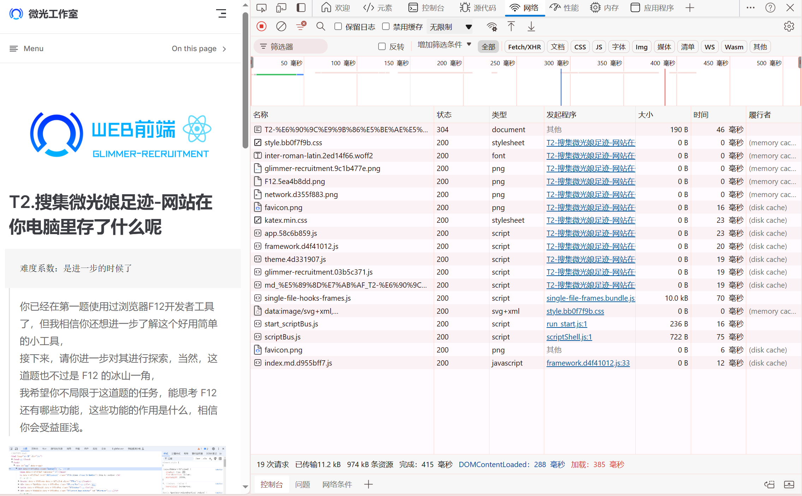
- 我的blog属于**静态网页**，哪怕还没有部署在互联网上，但满足静态网页的特点，即内容固定、不随用户交互而改变
- 此外动态/静态网页并不是绝对的

# CSS
### 选择器优先级？
(1)四组数字比较权重，**id>类>元素**
(2)注意复合选择器有权重叠加需要**先计算权重**再比较
(3)继承的权重是**0**

- 内联选择器：1000
- ID选择器：100
- 类选择器、伪类选择器和属性选择器：10
- 类选择器（多个类）：每增加一个类选择器，优先级增加10
- 类型选择器和伪元素选择器：1
- 通配选择器：0

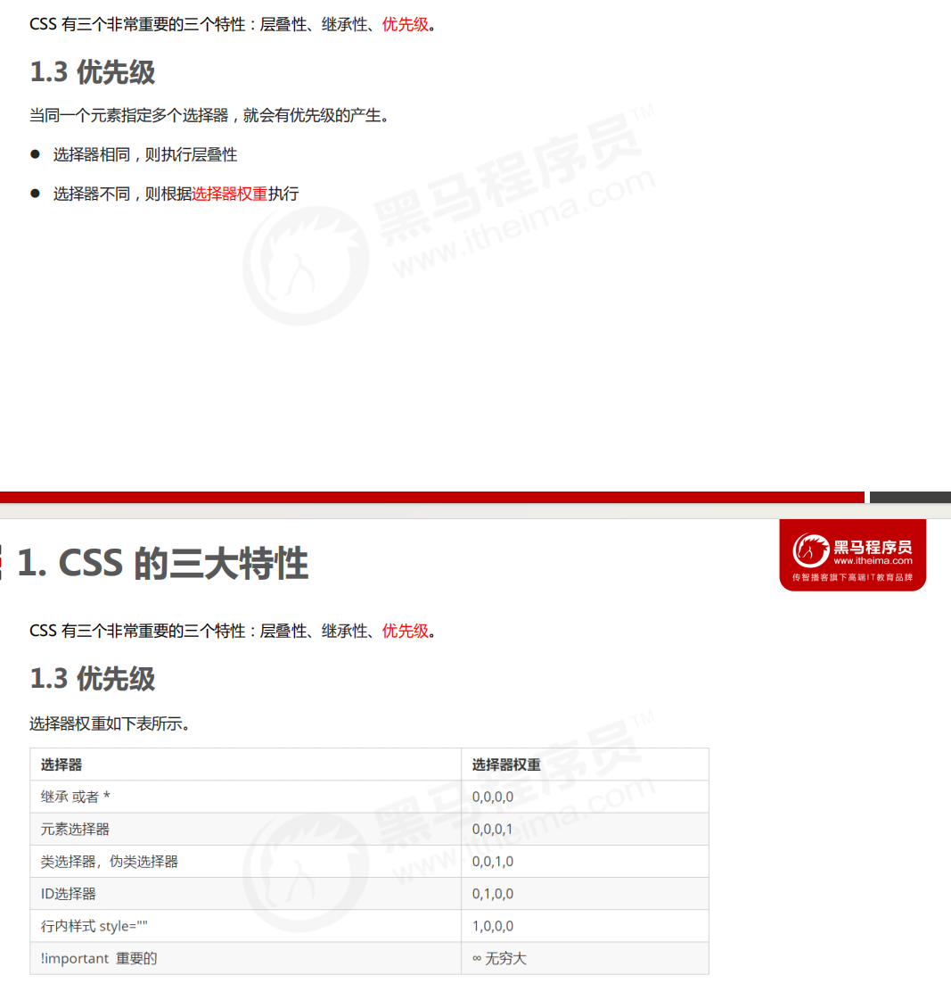
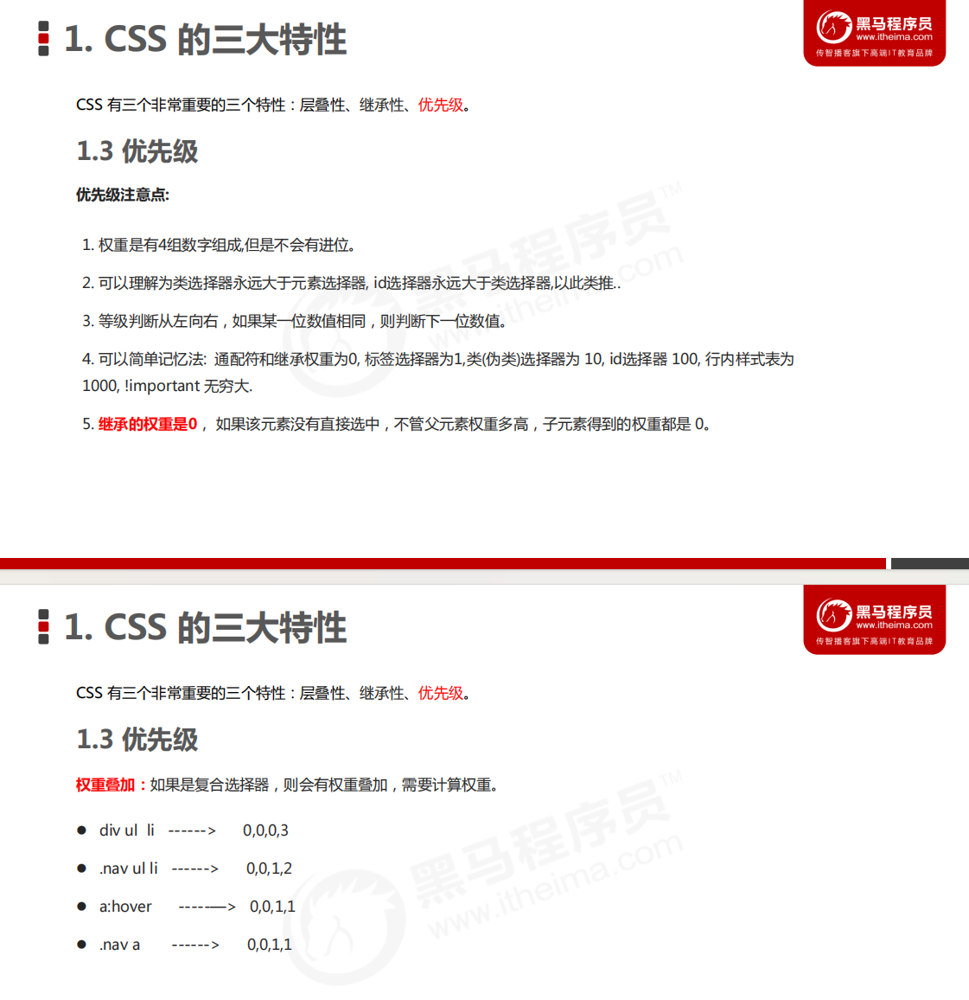

注：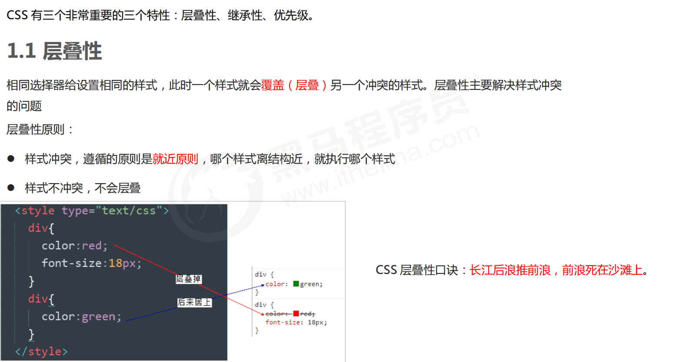


即**就近原则**